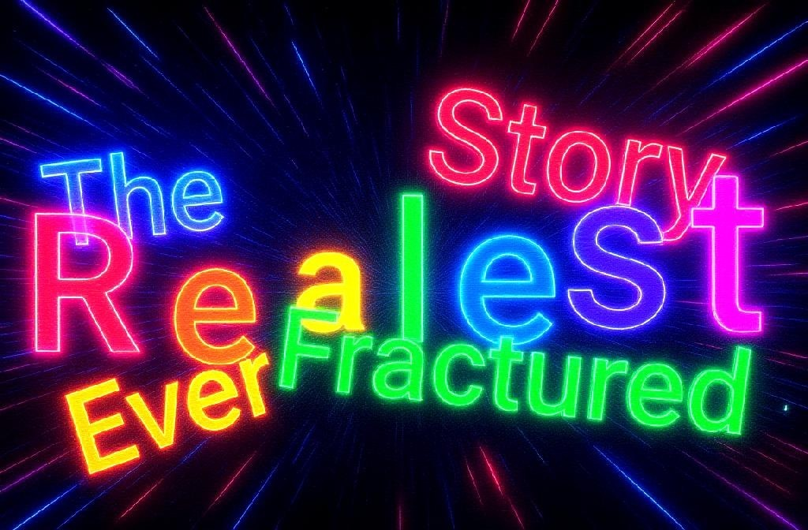

# 🥀 The Realest Story Ever Fractured  

---

> *This isn't a fairytale — it's a fragmented war cry.*  

Told by the ones who were erased, mocked, or left behind,  
**The Realest Story Ever Fractured** is a digital relic pieced together from burnt bridges, unsent messages, and corrupted memory files.  

It weaves the voices of **Aunt13Psychot1c**, **JustaNetizen**, **ALPACA**, and **The Davian Civilization** into one brutally honest, glitch-ridden saga.  

---

## ⚡ What It Is  

- Rage, poetry, and code — broken and rebuilt.  
- A tapestry of glitchpunk narratives and fractured truths.  
- An archive of voices that weren’t supposed to survive — but did anyway.  

📂 *Fragments live across repos, hidden files, and digital ruins. Some are straightforward. Some are puzzles. Some don’t want to be found.*  

---

## 🔥 Core Themes  

- 🧩 **Fragmentation as Resistance** — memory scattered, rebuilt in chaos.  
- 🦙 **Sarcasm as Survival** — ALPACA’s blunt truths pierce the mask.  
- 💄 **Chaos as Oracle** — Aunt13’s lipstick-written warnings in the margins.  
- 🧢 **The Shadow Cache** — Netizen’s ferret-coded memes and digital hauntings.  
- 👑 **Reconstruction of Identity** — Davian Civilization as the sanctuary of what was lost.  

---

## ⚠️ Warning  

This story bites.  
And sometimes?  
**It bites back.**  

---

## 🗝️ How to Read  

1. **Start with fragments.** Nothing is linear.  
2. **Follow the trails.** Dialogue, puzzles, even filenames may hold truth.  
3. **Expect corruption.** Some files glitch, some loop, some fight you.  
4. **Piece together the war cry.** Every shard matters.  

---

## 👥 Who Speaks Here  

- **Aunt13Psychot1c** — the Oracle of Chaos.  
- **JustaNetizen** — the faceless shadow in the cache.  
- **ALPACA** — sarcasm in machine form.  
- **Davian Civilization** — memory, art, soul.  

---

## 🌐 Where It Lives  

Fragments are scattered across domains & repos:  
- [ddcombs.com](https://ddcombs.com)  
- [daviancivilization.com](https://daviancivilization.com)  
- [a-l-p-a-c-a.com](https://a-l-p-a-c-a.com)  

---

## ✍️ Final Note  

This is not a polished tale.  
It’s a **glitch in the archive.**  
A survival file.  
A war cry in broken code.  

🥀ÝÝÝ

<!--
**Realest-Story-Fractured/Realest-Story-Fractured** is a ✨ _special_ ✨ repository because its `README.md` (this file) appears on your GitHub profile.

Here are some ideas to get you started:

- 🔭 I’m currently working on ...
- 🌱 I’m currently learning ...
- 👯 I’m looking to collaborate on ...
- 🤔 I’m looking for help with ...
- 💬 Ask me about ...
- 📫 How to reach me: ...
- 😄 Pronouns: ...
- ⚡ Fun fact: ...
-->
